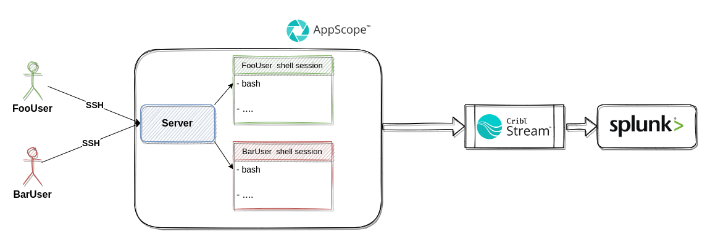

<h1> splunk-appscope </h1>

This demo uses Splunk to visualize data collected with [AppScope](https://github.com/criblio/appscope), an open source, runtime-agnostic instrumentation utility for any Linux command or application.

**Contents**

- [Prerequisites](#prerequisites)
- [Overview](#overview)
- [Cribl Stream configuration](#cribl-stream-configuration)
- [Preparation](#preparation)
  - [Building](#building)
  - [Testing](#testing)
- [Using the demo](#using-the-demo)
  - [Scoping the bash session](#scoping-the-bash-session)
  - [Scoping an individual command](#scoping-an-individual-command)
- [Cleaning up after a session](#cleaning-up-after-a-session)

## Prerequisites

For this demo environment, you will need Docker, `bash`, `openssl` and `curl`.

## Overview

This demo environment uses:

- [AppScope](https://appscope.dev/) to instrument applications running in the demo environment.
- [Cribl Stream](https://cribl.io/stream/) as a agent.
- [Splunk](https://www.splunk.com/) to store data and visualize metrics and events.

By default, the services will be available at the following URLs:

|Service|URL|
|-------|---|
|Cribl Stream|[http://localhost:9000](http://localhost:9000)|
|Splunk|[http://localhost:8000](http://localhost:8000)|

If you want to modify these settings, edit the `.env` file.

The diagram below depicts the demo cluster.


The diagram below depicts the demo scenario.


## Cribl Stream configuration

The diagram below depicts the Cribl Stream configuration.


## Preparation

The demo provides two interfaces, each of which runs in its own Docker container:

- `appscope01` for scoping an entire bash session using TCP connection.
- `appscope02` for scoping an individual command using TCP connection.
- `appscope01_tls` for scoping an individual command using TLS Secure Connections.

You can opt to use a fourth interface, which simply runs AppScope on the host in the usual way (without running a Docker container).

If this is your desired option, you must configure a Cribl Stream port to receive data from AppScope. Note that Cribl Stream _is_ running in its own Docker container, named `cribl01`.

To do this, edit the `docker-compose.yml` to match the following:

```
  cribl01:
    ...
    ports:
      - "${CRIBL_HOST_PORT:-9000}:9000"
      - 10090:10090
      - 10091:10091
```

What this does is exposed ports `10090` and `10091` to the host. The ports can be used to send data by AppScope
(running on host):

- for TCP `tcp://127.0.0.1:10090`
- for TLS `tcp://127.0.0.1:10091` see [setup details](https://appscope.dev/docs/tls/#using-tls-for-secure-connections)

CA certificate file:`domain.crt` is automatically generated by `./start.sh` script.

### Building

To build the demo:

```bash
./start.sh
```

### Testing

To confirm that everything works correctly:

```bash
docker ps
```

You should see results similar to this:

```bash
CONTAINER ID   IMAGE                 COMMAND                  CREATED         STATUS                            PORTS                                                                                                                                                                     NAMES
edab4853a82b   cribl/scope:1.1.0     "bash"                   7 seconds ago   Up 5 seconds                                                                                                                                                                                                appscope02
312445815f95   splunk/splunk:8.2.6   "/sbin/entrypoint.sh…"   7 seconds ago   Up 5 seconds (health: starting)   8065/tcp, 0.0.0.0:8000->8000/tcp, :::8000->8000/tcp, 8088/tcp, 8191/tcp, 0.0.0.0:8089->8089/tcp, :::8089->8089/tcp, 0.0.0.0:9997->9997/tcp, :::9997->9997/tcp, 9887/tcp   splunk01
ec825831bc67   cribl/cribl:3.4.2     "/sbin/entrypoint.sh…"   7 seconds ago   Up 6 seconds                      0.0.0.0:9000->9000/tcp, :::9000->9000/tcp                                                                                                                                 cribl01
6295edd8c4d6   cribl/scope:1.1.0     "bash"                   7 seconds ago   Up 6 seconds                                                                                                                                                                                                appscope01_tls

```

## Using the demo

This section covers how to run the `appscope01`, `appscope02` and `appscope01_tls` containers; no special instructions are needed for the fourth option, of running AppScope on the host in the usual way.

### Scoping the bash session

Connect to the `appscope01` container:

```bash
docker-compose run appscope01
```

Every command that you run in the bash session will be scoped.

### Scoping an individual command

Connect to the `appscope02` container and run the desired command:

```bash
docker exec -it appscope02 bash
ldscope <command>
```

Connect to the `appscope01_tls` container and run the desired command:

```bash
docker exec -it appscope01_tls bash
ldscope <command>
```

## Cleaning up after a session

To clean up the demo environment:

```bash
./stop.sh
```
